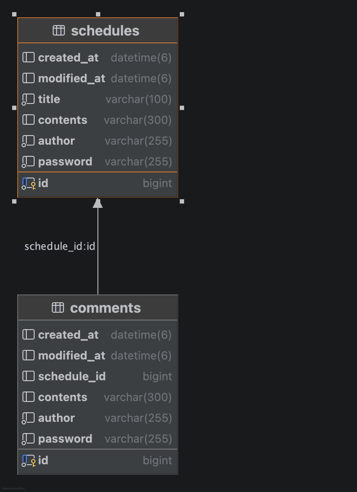

# 🗓️ 일정 관리 앱 (with 댓글 & 유저 관리)

Spring Boot를 활용한 개인 일정 및 댓글 관리 API 서버입니다.

계층형 아키텍처(3-Layer Architecture)를 준수하며, JPA 페이징 최적화와 세션 기반 인증을 통해 안정적이고 효율적인 백엔드 시스템을 지향합니다.

---

## 🔗 API 명세서 (Postman)
상세한 API 사용법과 예시 데이터는 아래 링크에서 확인하실 수 있습니다.
- [일정 관리 API 명세서](https://documenter.getpostman.com/view/8007044/2sBXc7M58q#f80c3477-42c8-4fa7-b472-ca0ec13194d9)

---

## 🚀 주요 기능

### 1. 일정 관리 및 페이징 조회
* **페이징 목록 조회**: `Pageable`을 활용하여 일정 목록을 10개 단위로 끊어서 조회하며, 수정일 기준 내림차순 정렬을 보장합니다.
* **성능 최적화**: JPQL 조인을 활용하여 일정 정보와 함께 **해당 일정의 댓글 개수(commentCount)**를 단일 쿼리로 효율적으로 집계합니다.
* **상세 조회**: 특정 일정의 상세 정보와 함께 해당 일정에 달린 전체 댓글 리스트를 동시 출력합니다.

### 2. 유저 인증 및 권한 검증
* **세션 기반 인증**: `AuthExtension` 유틸리티 클래스를 통해 로그인 세션을 검증하고 인가된 사용자만 기능을 사용하도록 제한합니다.
* **작성자 본인 확인**: 일정 수정 및 삭제 시, DB의 작성자 ID와 세션의 로그인 유저 ID를 대조하여 **본인이 작성한 데이터만 관리**할 수 있도록 보호 로직을 구현했습니다.

### 3. 댓글 관리 시스템
* **연관 관계 설계**: DB 원자성을 유지하기 위해 `Schedule` 엔티티 내에 리스트를 두지 않고, 댓글이 일정의 ID를 참조하는 **단방향 매핑(@ManyToOne)** 구조를 채택했습니다.
* **유효성 검사**: 댓글 내용(100자 이내) 및 필수 데이터에 대한 검증을 수행합니다.

### 4. 전역 예외 처리 (Exception Handling)
* **응답 규격화**: `@RestControllerAdvice`를 통해 비즈니스 로직 예외 상황 발생 시 공통 에러 포맷을 반환하여 클라이언트와의 통신 효율을 높였습니다.

---

## 🛠️ 기술 스택
- **언어 및 프레임워크**: Java 17, Spring Boot 4.0.2
- **데이터베이스**: MySQL
- **ORM**: Spring Data JPA
- **도구**: Lombok, Gradle, Postman

---

## 📊 데이터베이스 설계 (ERD)

- **User (1) : Schedule (N)** 관계
    - 사용자는 여러 개의 일정을 생성할 수 있으며, 일정은 생성한 사용자의 정보를 가집니다.
- **Schedule (1) : Comment (N)** 관계
    - 하나의 일정에는 여러 개의 댓글이 달릴 수 있습니다.
- **관계 설계**:
    - 모든 엔티티는 객체 지향적 복잡성을 줄이고 DB 원자성을 준수하기 위해 외래 키(FK)를 기반으로 한 **단방향 연관관계(@ManyToOne)**로 설계되었습니다.
    - 댓글 엔티티는 일정의 ID(`schedule_id`)를, 일정 엔티티는 유저의 ID(`user_id`)를 외래키로 가집니다.

